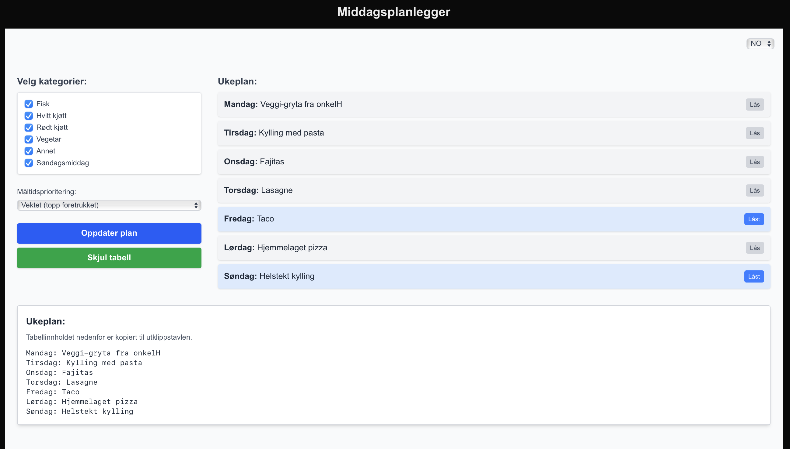

# Middag: Yet Another Dinner Planner™️

Tired of the eternal question, "Hva skal vi ha til middag?" (What's for dinner?) Staring blankly into the fridge abyss? Arguing with your significant other/cat/inner monologue about whether it's a fish or fajita kind of day?

Fear not, for **Middag** is here! It's a surprisingly functional (most of the time) Next.js application designed to take the *thinking* (and maybe some of the arguing) out of your weekly dinner planning.


*(Yes, it actually looks like this!)*

## What Does It Actually Do?

This isn't just *any* dinner planner. This is a sophisticated piece of engineering that:

1.  Fetches meal ideas from a **mysterious Excel sheet** living somewhere on the internet (seriously, check the `.env` requirement).
2.  Lets you filter by meal categories because maybe you're *not* feeling "Rødt kjøtt" (Red meat) today.
3.  Generates a weekly meal plan using algorithms ranging from "pure chaos" (random) to "slightly less chaos" (weighted towards the top of your Excel list).
4.  Allows you to **lock in** those non-negotiable Taco Fridays 🌮.
5.  Features **drag-and-drop** reordering for when the generated plan feels *slightly* insulting.
6.  Supports **manual editing** double-click a meal to change it, because you're the boss, not the spreadsheet!
7.  Includes a handy **copy-to-clipboard** feature for easy sharing (or printing and sticking to the fridge with questionable magnets).
8.  Speaks multiple languages! (Currently NO 🇳🇴, EN 🇬🇧, ES 🇪🇸) - ¡Olé!

Built with modern web tech and deployed serverlessly on the edge via Cloudflare Pages, because why not?

## Key Features Rundown ✨

*   🍽️ Fetches meal data from an online Excel file (`.xlsx`).
*   ✅ Select/deselect meal categories.
*   🎲 Random or Weighted meal plan generation.
*   🔒 Lock/Unlock specific days.
*   👆 Drag-and-drop reordering of the meal plan.
*   ✏️ Manually edit meals directly in the plan.
*   📋 Copy plan to clipboard.
*   🌍 Multi-language support (NO, EN, ES).
*   🚀 Deployed on Cloudflare Pages using OpenNext.

## Tech Stack 🛠️

*   **Framework:** Next.js 15 (React 19)
*   **Language:** TypeScript
*   **Styling:** Tailwind CSS 4 & PostCSS
*   **Drag & Drop:** @dnd-kit
*   **Excel Parsing:** SheetJS (xlsx)
*   **Deployment:** Cloudflare Pages + OpenNext + Wrangler
*   **Linting:** ESLint
*   **IDs:** UUID

## Getting Started Locally 🚀

Want to run this masterpiece (or disasterpiece, depending on the day) yourself?

1.  **Clone the repo:**
    ```bash
    git clone https://github.com/torfinnnome/middag.git
    cd middag
    ```
2.  **Install dependencies:**
    ```bash
    npm install
    # or yarn install or pnpm install
    ```
3.  **Configure the magic spreadsheet URL:**
    *   Create a `.env.local` file in the root directory.
    *   Add the following line, replacing the URL with the *actual, publicly accessible* URL to your `.xlsx` file:
        ```dotenv
        MIDDAGSURL="https://your-spreadsheet-url-here.xlsx"
        ```
    *   **Spreadsheet Format:** The Excel file should have categories in the first row (A1, B1, C1, ...) and the corresponding meals listed below each category header. Like this:

        | Fisk      | Vegetar       | Annet           |
        | :-------- | :------------ | :-------------- |
        | Laks      | Linsegryte    | Taco            |
        | Torsk     | Kikertcurry   | Hjemmelaget Pizza |
        | Sei       | Bønneburger   | Fajitas         |
        | ...       | ...           | ...             |

4.  **Run the development server:**
    ```bash
    npm run dev
    ```
5.  Open [http://localhost:3000](http://localhost:3000) and behold the dinner-planning glory!

## Deployment ☁️

This project is deployed to **Cloudflare Pages** (v3) using the `@opennextjs/cloudflare` adapter for server-side rendering and edge deployment.

### Initial Setup

1.  **Connect your GitHub repository** to Cloudflare Pages via the [Cloudflare Dashboard](https://dash.cloudflare.com/).

2.  **Configure Build Settings:**
    *   **Framework preset:** None (or Next.js)
    *   **Build command:** `npm run cf-build`
    *   **Build output directory:** `.open-next/assets`
    *   **Node.js version:** The build uses Node.js 22.16.0 by default (Pages v3)

3.  **Set Environment Variables** in Cloudflare Pages project settings:
    *   `MIDDAGSURL`: The publicly accessible URL to your Excel file (`.xlsx`)

4.  **Deployment Configuration:**
    *   Configuration is in `wrangler.toml`
    *   The `cf-build` script builds with OpenNext and copies the worker file to enable SSR
    *   Automatic deployments trigger on `git push` to the main branch
    *   Preview deployments are created for pull requests

### Local Development & Testing

*   `npm run dev`: Local Next.js development server
*   `npm run preview`: Build and test locally using Wrangler dev server
*   `npm run deploy`: Build and deploy directly via Wrangler CLI (requires authentication)

### Requirements

*   **Node.js:** Version 18.18.0+ (20.x or 22.x recommended)
*   **Next.js:** 15.3.6+ (includes security patches for CVE-2025-55182)
*   **React:** 19.2.1+ (patched for critical RCE vulnerability)

## Available Scripts 📜

*   `dev`: Starts the local Next.js development server
*   `build`: Builds the Next.js application (used internally by OpenNext)
*   `cf-build`: Builds for Cloudflare Pages (OpenNext + worker setup)
*   `deploy`: Builds and deploys directly via Wrangler CLI
*   `lint`: Runs ESLint to check for code style issues
*   `preview`: Builds and runs a local preview using Wrangler dev server
*   `types`: Generates Cloudflare environment types (`env.d.ts`)
*   `check`: Full build, TypeScript check, and dry-run deploy

## Future Enhancements (Maybe?) 🤔

*   Storing meal data in a *real* database instead of a rogue spreadsheet.
*   User accounts? Probably too much effort.
*   Preventing the same meal twice in one week (unless it's pizza, obviously).
*   AI suggestions based on leftover yogurt and that one questionable vegetable in the back of the fridge (highly unlikely).
*   More languages? Submit a PR!

## License

MIT License

---

Vel bekomme! (Enjoy your meal!)
